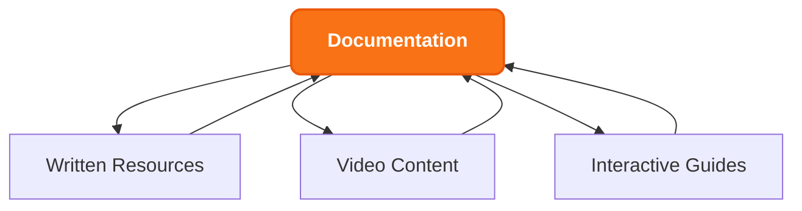

#### 1. Technical Documentation

#### 2. Content Types
- Create comprehensive implementation guides and references
- Develop system architecture documentation
- Build performance optimization guides
- Maintain up-to-date API documentation
- Design interactive code examples

#### 3. Video Resources
- Produce short-form technical tutorials (2-3 minutes)
- Create in-depth technical deep-dives
- Record implementation walkthroughs
- Showcase best practice demonstrations
- Host expert interview series

#### 4. Educational Programs
- Design ZKHub Dissertation Series
  - Technical deep-dive sessions
  - Implementation case studies
  - Architecture discussions
  - Performance analysis reviews

#### 5. Interactive Learning
- Develop hands-on workshop series
  - Implementation practice sessions
  - Problem-solving workshops
  - Code review workshops
  - Architecture design labs

#### 6. Community Content
- Foster user-generated content
- Highlight community tutorials
- Showcase implementation examples
- Feature success stories