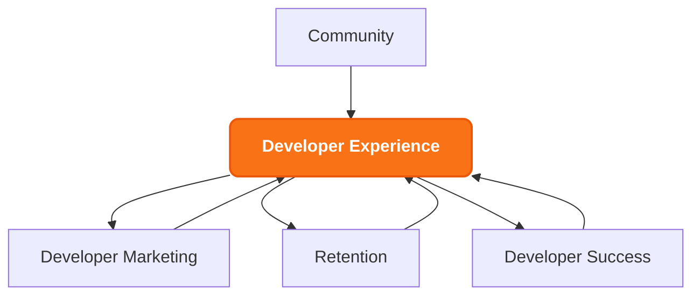

#### 1. Developer Experience (DX) Focus

- Design frictionless onboarding pathways with clear success metrics
- Create intuitive documentation and self-service resources
- Implement feedback loops to continuously improve developer journey
- Build tools and components that inspire creative implementation

#### 2. Community Empowerment
- Create vibrant Discord community with structured engagement programs
- Foster peer-to-peer knowledge sharing and collaboration
- Implement B2D relationship-driven community management
- Showcase developer success stories and implementations

#### 3. Educational Excellence
- Create comprehensive tutorial series covering:
  - Advanced system architecture
  - Optimization techniques
  - Implementation patterns
  - Best practices and standards
- Design outcome-driven learning paths
- Implement continuous improvement through community feedback

#### 4. Enablement Framework
- Create streamlined contribution pathways
- Build and maintain high-quality developer tools
- Remove friction from build and deploy processes
- Provide clear paths to production deployment

#### 5. Success Promotion
- Document and showcase developer success stories
- Create case studies of innovative implementations
- Highlight community achievements
- Feed successful patterns back into educational resources
