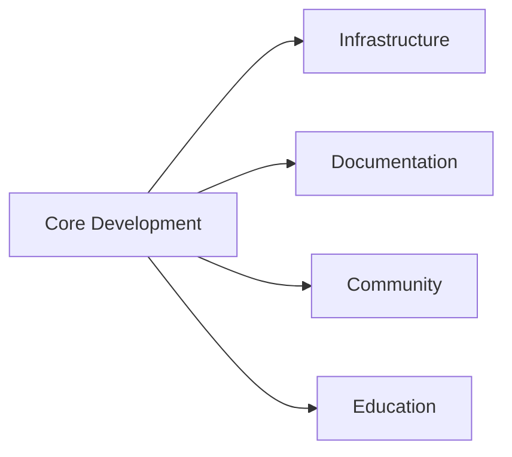
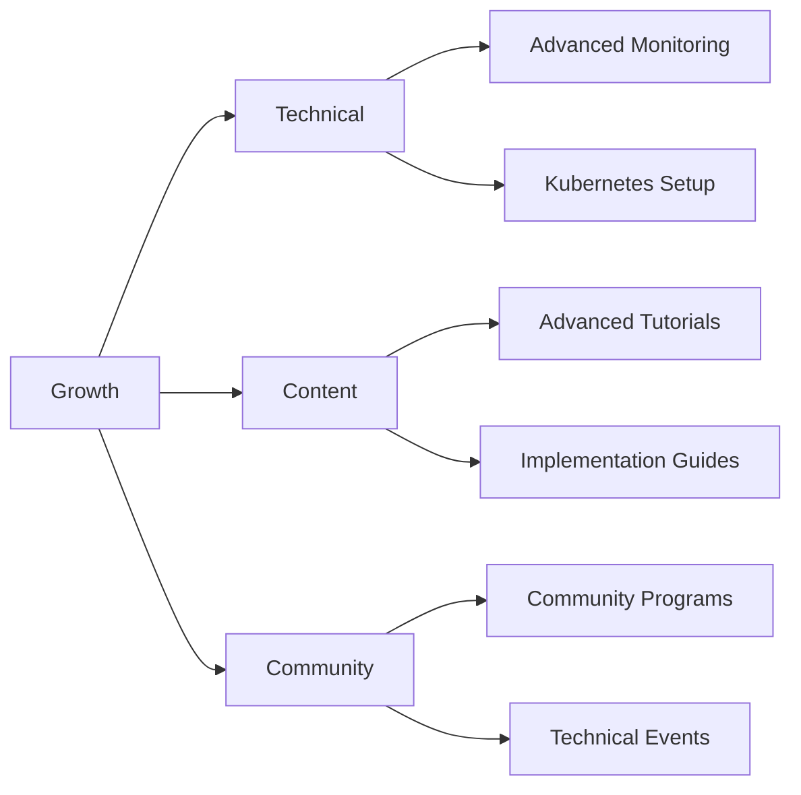
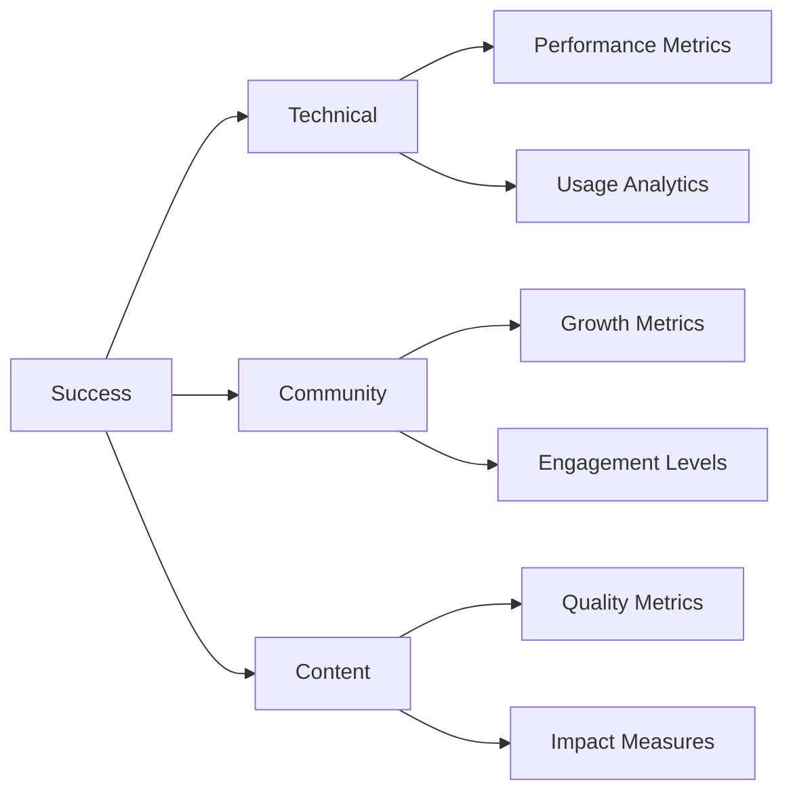

#### 1. Core Components

#### 2. Phase One: Foundation [[Phase 1 Foundation Building]]
- Deploy Basic Infrastructure [[Infrastructure Development]]
  - Monitoring stack implementation
  - Development environment setup
  - Baseline metrics establishment
  - Support channel creation

- Documentation Framework [[Technical Documentation]]
  - Core documentation structure
  - Basic tutorial development
  - Style guide creation
  - Knowledge base setup

- Community Groundwork [[Community Engagement]]
  - Discord community setup
  - Engagement guidelines
  - Initial ambassador program [[Ambassador Program]]
  - Support workflow establishment

#### 3. Phase Two: Growth [[Phase 2 Resource Development]]

- Technical Expansion [[Infrastructure Development]]
  - Advanced monitoring deployment
  - Kubernetes implementation
  - Resource optimization
  - Performance tuning

- Content Development [[Content Creation]]
  - Advanced tutorial series
  - Implementation guides
  - Video content creation
  - Interactive learning tools

- Community Building [[Developer Engagement]]
  - Technical workshops
  - Recognition systems
  - Event series launch
  - Contributor program

#### 4. Phase Three: Optimization [[Phase 3 Ecosystem Growth]]
- Infrastructure Enhancement [[Infrastructure Status]]
  - Full Kubernetes deployment
  - Advanced monitoring systems
  - Scaling optimization
  - Performance metrics

- Advanced Content [[Developer Resources]]
  - Specialized learning tracks
  - Technical deep-dives
  - Case study development
  - Expert-level resources

- Community Scale [[Community Engagement]]
  - Advanced ambassador initiatives
  - Content creation program
  - Technical mentorship
  - Expert network development

#### 5. Success Indicators [[Success Metrics]]

- Key Metrics [[Performance Analytics]]
  - System performance
  - Developer adoption
  - Documentation effectiveness
  - Community engagement
  - Content quality
  - Support efficiency

#### 6. Long-term Vision [[Strategic Objectives]]
- Self-Sustaining Ecosystem
  - Active developer community
  - Comprehensive resources
  - Optimized infrastructure
  - Industry-leading documentation
  - Thriving contributor network
  - Advanced technical programs