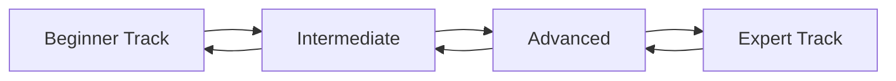

#### 1. Learning Pathways

- Design progressive learning tracks
- Create systematic tutorial organization
- Develop comprehensive implementation guides
- Establish best practices documentation

#### 2. Resource Organization
- Build unified documentation hub
  - Searchable knowledge base
  - Organized video content
  - Interactive tutorials
  - Reference materials

#### 3. Content Structure
- Implement clear navigation systems
- Create consistent documentation patterns
- Establish version control practices
- Maintain up-to-date examples

#### 4. Quality Assurance
- Regular content review cycles
- Community feedback integration
- Expert technical validation
- Continuous improvement process