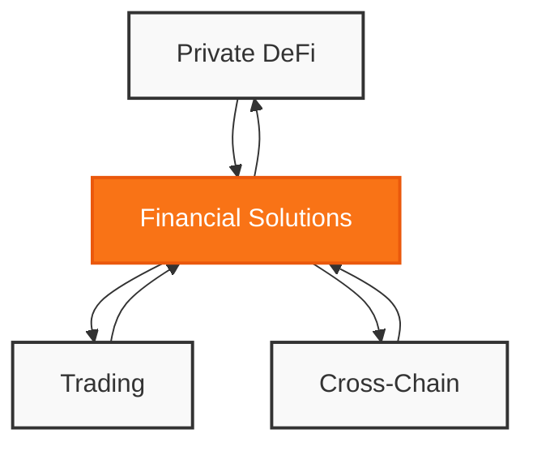
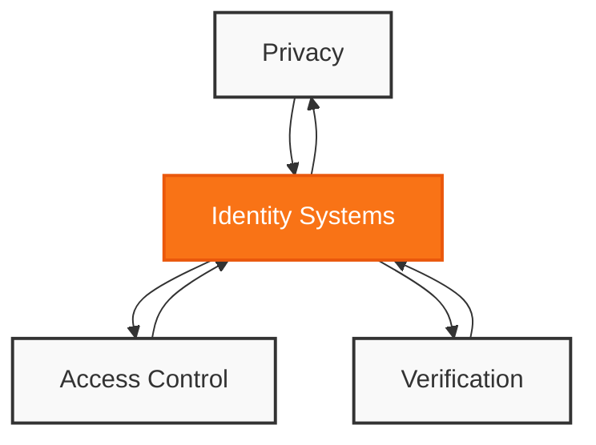

#### Financial Applications

- Build private DeFi operation examples
  - Transaction privacy systems
  - Confidential trading mechanisms
  - Secure asset management
- Demonstrate cross-chain solutions
  - Bridge security protocols
  - Multi-chain settlement
  - State verification systems

#### 2. Identity Solutions

- Implement privacy-focused systems
  - Zero-knowledge KYC
  - Credential verification
  - Private identity management
- Create access control examples
  - Permission systems
  - Role verification
  - Secure authentication

#### 3. Gaming Applications
- Develop game state management solutions
  - Private state verification
  - Secure transaction systems
  - Player authentication
- Create gaming asset systems
  - Private inventory management
  - Secure trading mechanisms
  - Asset verification protocols
