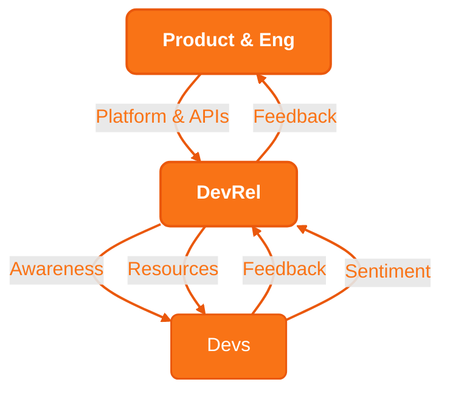

This strategy outlines ZKM's comprehensive approach to becoming a leading zero-knowledge system through focused developer enablement. Building upon infrastructure capabilities and addressing ecosystem challenges.

# Outline and Strategy => 

## Fast breakdown
[[Implementation Timeline and Roles]]

[[Research Focus]]
[[Developer Engagement]]
[[Content and Awareness]]
[[Implementation Framework]]
[[Strategic Objectives]]
[[Execution Plan]]

## Current Ecosystem Assessment
[[Infrastructure Status]]
[[Technical Documentation]]
[[Community Engagement]]

## Strategic Pillars
[[Infrastructure Development]]
[[Developer Resources]]
[[Content Creation]]
[[Use Case Demonstrations]]

## Implementation Framework
[[Phase 1 Foundation Building]]
[[Phase 2 Resource Development]]
[[Phase 3 Ecosystem Growth]]
[[Ambassador Program]]

## Infrastructure Research
[[Performance Analytics]]

## Strategic Objectives
[[Strategic Objectives]]

## Areas for Technical Specification
[[Areas for Technical Specification]]

## Unfiltered Recommendations
[[Unfiltered Recommendations]]

## Success Metrics
[[Success Metrics]]

## Conclusion

This Developer Enablement Strategy provides a comprehensive framework for building and scaling the ZKM ecosystem. Through structured implementation of these initiatives, we aim to create a robust, developer-friendly platform that drives innovation in the zero-knowledge proof space.

Success depends on:
- Consistent execution
- Community engagement
- Technical excellence
- Continuous improvement
- Regular feedback incorporation

The strategy's effectiveness will be measured through:
- Developer adoption rates
- Community growth
- Technical performance
- Resource efficiency
- Ecosystem expansion

Through this structured approach, ZKM will establish itself as a leading platform for zero-knowledge proof development and implementation.

----------------------

*Last Updated: 2024-11-27*  
*Version: 1.0.0*
*Author: Dylan*
*Editor: Kyle*
